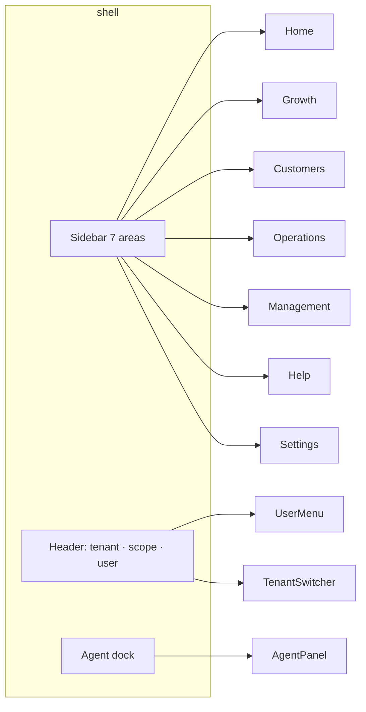

# Information architecture

Created: **2026-09-04**  
Invariant areas from [`../DASHBOARD-V1.md`](../DASHBOARD-V1.md). Navigation **positions do not change per tenant**.

## Why this structure

Operators live the lifecycle **acquire → follow up → convert → fulfill → collect → retain**. Seven areas map that day without a custom sitemap per niche:

| Area | Job |
| --- | --- |
| Home | What needs a human **today** |
| Growth | Move the funnel |
| Customers | People and pipeline |
| Operations | Work, agenda, fulfillment |
| Management | Company, money, catalog, integrations |
| Help | Tickets to Impulsionando |
| Settings | Identity, access, agent, notifications |

Optional modules stay **discoverable without clutter**: they appear as children inside these areas when `ACTIVE`/`READY`/`CONFIGURING`/`DEGRADED`; they appear as a **Module card** in Settings when `NOT_ENTITLED`. They never insert a new top-level item.

## Area hierarchy

```text
Home                    /dashboard
  Daily briefing
  Attention queue
  Internal agent (dock)
  Growth snapshot widgets
  Optional ops widgets (entitled only)

Growth                  /growth
  Overview              /growth
  Leads                 /growth/leads
  Campaigns             /growth/campaigns
  Follow-up             /growth/follow-up
  Conversion            /growth/conversion
  Retention             /growth/retention
  Reactivation          /growth/reactivation
  Attribution           /growth/attribution   (hidden unless capability; else UNKNOWN state)

Customers               /customers
  Contacts              /customers
  Leads                 /customers/leads
  Opportunities         /customers/opportunities
  Pipeline              /customers/pipeline
  Activities            /customers/activities
  Timeline              /customers/:id (detail)

Operations              /operations
  Today                 /operations
  Tasks                 /operations/tasks
  Team workload         /operations/workload
  Agenda                /operations/agenda          (module)
  Orders/fulfillment    /operations/orders          (module)
  Inventory alerts      /operations/inventory       (module)

Management              /management
  Company               /management/company
  Team and access       /management/team
  Modules               /management/modules
  Integrations          /management/integrations
  Finance overview      /management/finance
  Payables              /management/finance/payables
  Receivables           /management/finance/receivables
  Products/services     /management/catalog
  Inventory             /management/inventory
  Documents             /management/documents
  Billing               /management/billing
  Payments              /management/payments
  Reports               /management/reports

Help                    /help
  Tickets               /help
  Ticket detail         /help/:id
  Create ticket         /help/new
  Product help          /help/guide
  Knowledge base        /help/kb          (when available)

Settings                /settings
  Profile               /settings
  Company identity      /settings/company
  Branding              /settings/branding
  Team/access           /settings/access
  Modules               /settings/modules     (alias of management modules)
  Integrations          /settings/integrations
  Agent                 /settings/agent
  Notifications         /settings/notifications
```

Auth (no chrome): `/login` · `/reset-password` · onboarding `/onboarding/*`

Probes: `/healthz` · `/ready` (not in nav).

## Navigation diagram (desktop)



Sidebar order is **fixed**. Do not alphabetize, do not tenant-sort.

Collapsed sidebar (≥1024, icon mode): icons + tooltips; current area `aria-current="page"`.

## Local navigation

Inside an area, **tabs** or a **secondary list** (Management) — never a second sidebar. Breadcrumbs: `Área / Página / Objeto` from `h1` down; Home has no breadcrumb.

## Mobile navigation (320–767)

1. Top bar: menu (opens sheet of 7 areas + user), tenant name truncated, agent launcher.
2. **Persistent bottom bar** (thumb): Início · Crescimento · Clientes · Operações · **Mais**
3. **Mais** sheet: Gestão, Ajuda, Configurações, plus overflow children.
4. Bottom bar height 64px + `env(safe-area-inset-bottom)`.
5. Agent panel is a **full-screen sheet**, not a side dock.

Tablet 768–1023: sidebar as sheet (template `use-mobile`); no bottom bar if sheet is used — **pick one**. Spec: **sheet from hamburger** at tablet, **bottom bar only <768**, to avoid two competing navs.

## Tenant switcher

Show when the session has **more than one** membership. Otherwise omit (do not show a disabled control).  
`REQUIRES PRODUCT DECISION`: whether staff can switch into a tenant without leaving Impulsionito scope — UI must still show **scope chip** (see AI-EXPERIENCE).

## User menu

Profile, theme (light/dark/system), sign out. Staff: “Painel Impulsionando” if in tenant, and vice versa.

## Command menu

`⌘K` / `Ctrl+K`: jump to areas, recent records **the user can see**, help. No privileged search. Empty query shows areas only.

## Disabled / not entitled

Nav item remains in place (structure invariant) with `aria-disabled` and caption **Indisponível no plano** or **Em configuração**. Clicking opens the module state view, not a 404.

## Public vs admin

`tenant-web` IA is **not** this tree. Public: business info, catalog, booking, checkout, support, client agent. No Home/Growth/Management.

## Staff IA

Same seven areas are **not** all present. Staff console uses the **same shell** with a different manifest: Tenants, Plans, Health, Support, Integrations, Agents (Impulsionito). Visual distinction: scope chip **Impulsionando · Impulsionito**, Impulso color (not tenant color).
